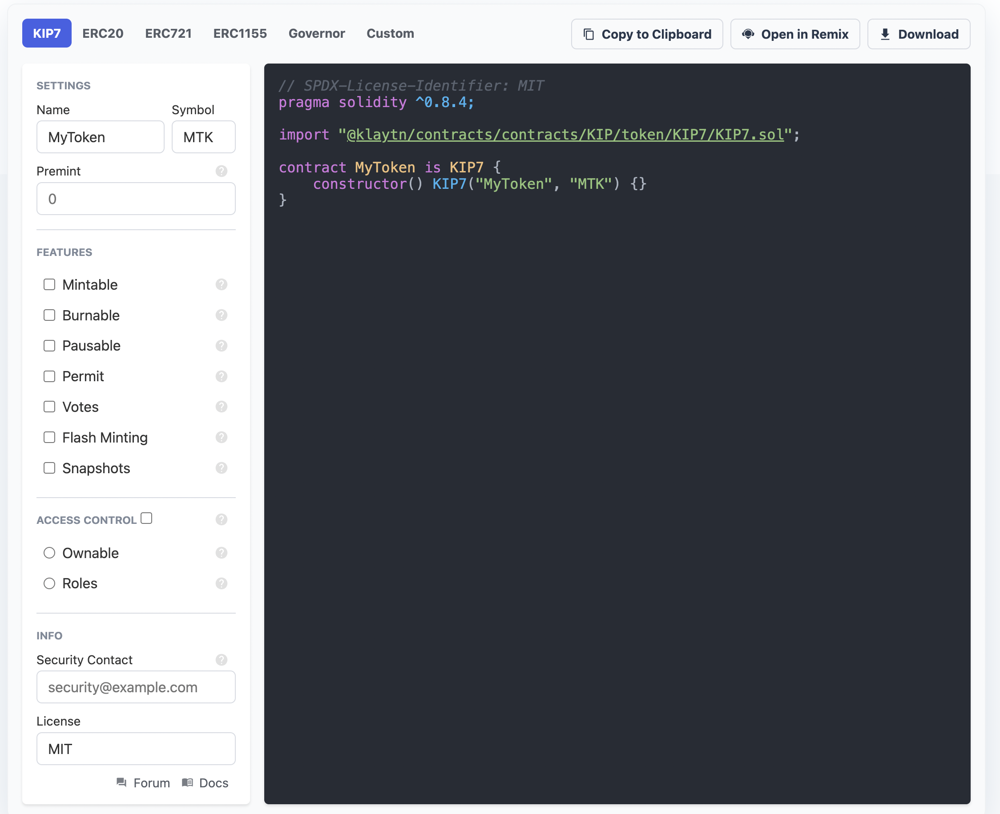

# Branch name will be changed

We will change the `master` branch to `main` on Dec 15, 2022.
After the branch policy change, please check your local or forked repository settings.

# [Klaytn Contracts Wizard](https://github.com/klaytn/klaytn-contracts-wizard.git)

This repository is forked from Openzepplin Contracts Wizard. This is a web application to interactively build a contract out of components from Klaytn Contracts. Select the kind of contract that you want, set your parameters and desired features, and the Wizard will generate all of the code necessary. The resulting code is ready to be compiled and deployed, or it can serve as a starting point and customized further with application specific logic.

## Development

`packages/core` contains the code generation logic for Solidity.

`packages/core-cairo` contains the code generation logic for Cairo.

`packages/ui` is the interface built in Svelte. `yarn dev` spins up a local server to develop the UI.

## API

The following describes how to use the Contracts Wizard programmatic API in your own applications.

- [Contracts Wizard API for Solidity](packages/core/README.md)
- [Contracts Wizard API for Cairo](packages/core-cairo/README.md)
