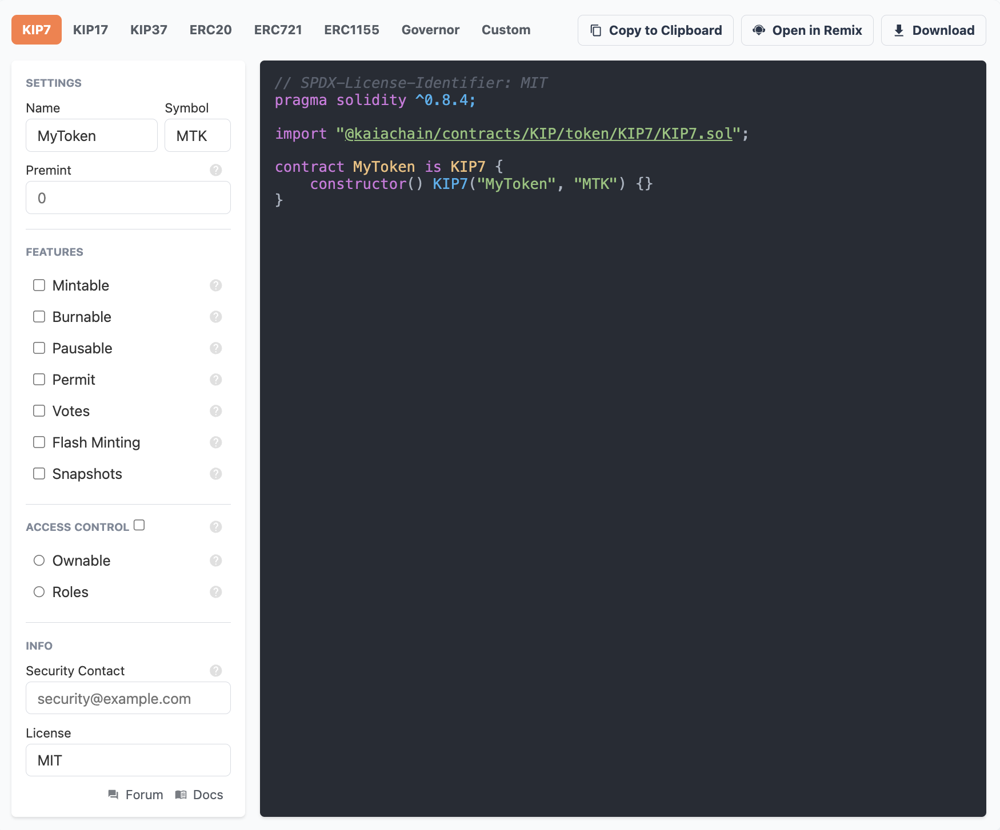

# NO LONGER MAINTAINED

Since the launch of Kaia Blockchain this repository has been parked in favour of the new open-source projects in [Kaia's Github](https://github.com/kaiachain). Contributors have now moved there continuing with massive open-source contributions to our blockchain ecosystem. A big thank you to everyone who has contributed to this repository. For more information about Klaytn's chain merge with Finschia blockchain please refer to the launching of Kaia blockchain - [kaia.io](http://kaia.io/).

---

# [Klaytn Contracts Wizard](https://github.com/klaytn/klaytn-contracts-wizard.git)

This repository is forked from Openzepplin Contracts Wizard. This is a web application to interactively build a contract out of components from Klaytn Contracts. Select the kind of contract that you want, set your parameters and desired features, and the Wizard will generate all the code necessary. The resulting code is ready to be compiled and deployed, or it can serve as a starting point and customized further with application specific logic.

## Development
`yarn` from the root folder to install all the dependencies 

`packages/core` contains the code generation logic for Solidity.

`packages/ui` is the interface built in Svelte. `yarn dev` spins up a local server to develop the UI.

## API

The following describes how to use the Contracts Wizard programmatic API in your own applications.

- [Contracts Wizard API for Solidity](packages/core/README.md)
